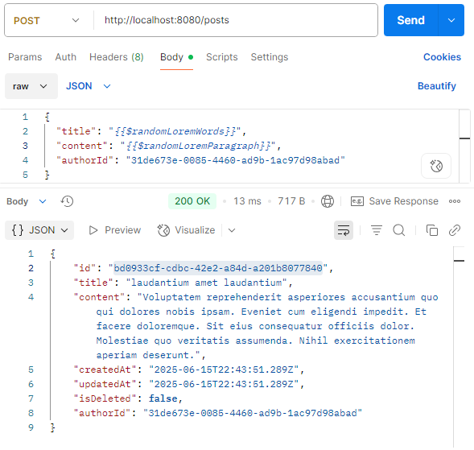

# Blog RESTFul API

A simple **RESTful API** for managing users and blog posts, built with:

- Express.js (server framework)
- Prisma ORM (database interaction)
- PostgreSQL (relational database)

This API allows **creating, fetching, updating, and deleting posts**, with support for **soft deletion**.

## Endpoints

## 1. Users

### GET /users

- Returns a list of all users.

  

### GET /users/:id

- Returns a specific user by ID along with their blog posts.
  

### POST /users

- Creates a new user with random variables available in POSTMAN.

#### Request body

```json
{
  "firstName": "{{$randomFirstName}}",
  "lastName": "{{$randomLastName}}",
  "emailAddress": "{{$randomEmail}}",
  "userName": "{{$randomUserName}}"
}
```


## 2. Posts

### GET /posts

- Get all posts including author details for each post.
- The returned post should not include post where **isDeleted** is **true**.


### GET /posts/:id

Returns a specific post by post Id.


### POST /posts

- Creates a new blog post with random variables available in POSTMAN. This is linked to a specific user by authorId (userId).



### PUT /posts/:id

- Update a specific post by post Id and **only if it's not deleted.**

#### Request body

```json
{
  "title": "{{$randomLoremWords}}",
  "content": "{{$randomLoremParagraph}}"
}
```


### DELETE /posts/:id

- We perform soft deletion on posts, where by we set the isDeleted to true.

- When querring data we hide posts which have the value **isDeleted** set to **true.**


**Made by** [Brian Njoroge](https://github.com/briannjoroge) with 💓
